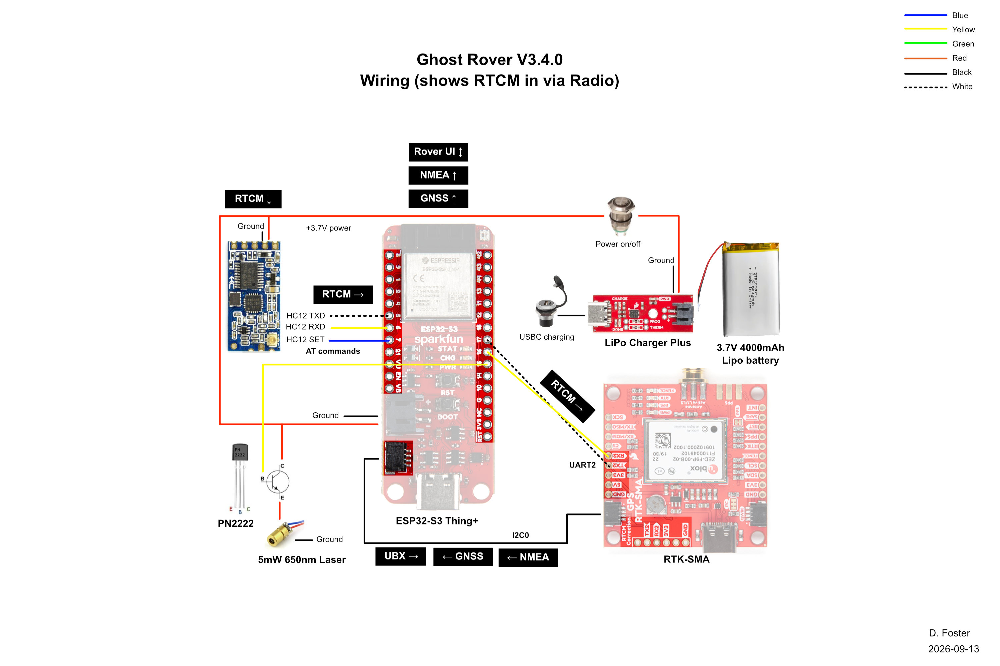
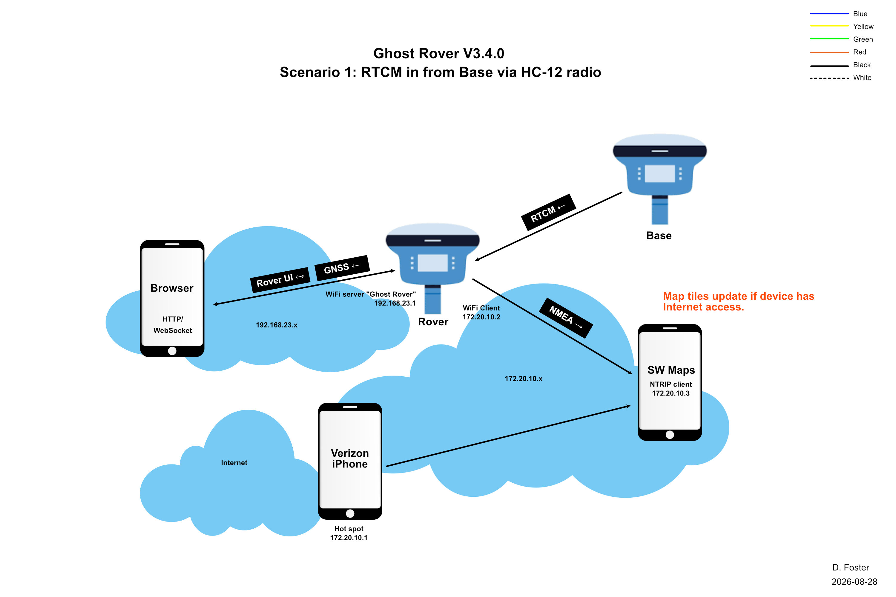
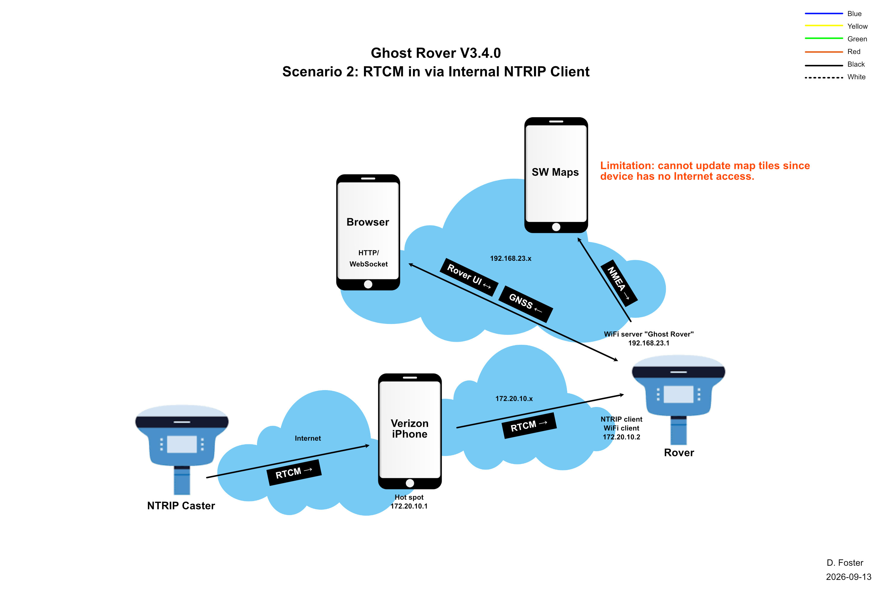
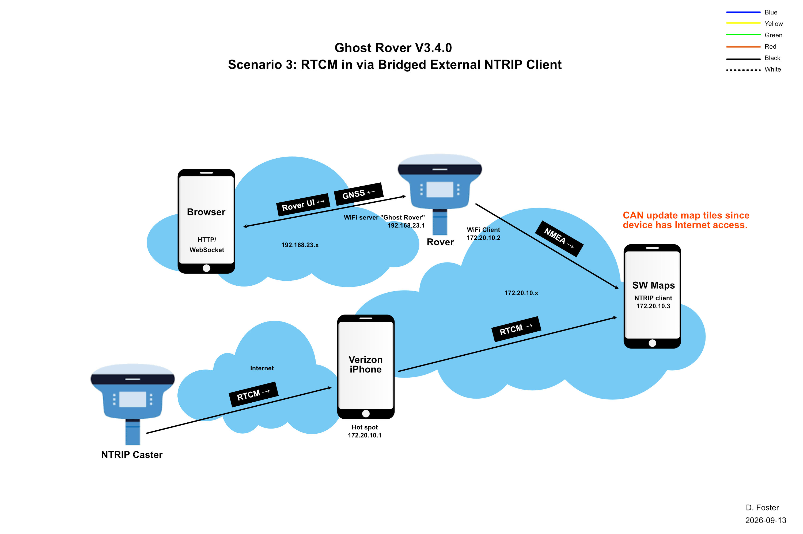

# Ghost Rover - Version 3
"Invisible" GNSS rover.  
Last updated 2026-09-13.  
https://github.com/doug-foster/DougFoster_Ghost_Rover  
https://github.com/doug-foster/DougFoster_Ghost_Rover_EVK_RTCM_relay  
 

