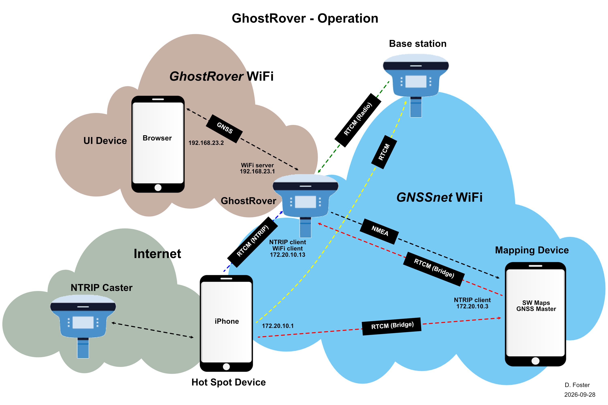
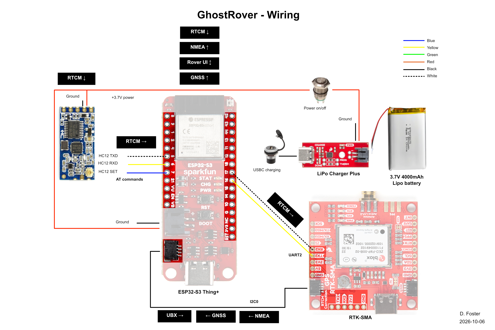

# GhostRover - Version 3.4

## GitHub Repositories
* https://github.com/doug-foster/DougFoster_Ghost_Rover
* https://github.com/doug-foster/DougFoster_Ghost_Rover_EVK_RTCM_relay

## Description & Operation

GhostRover is an "invisible" GNSS rover.

Invisible?

Let's say you want to record a survey point by using a geo-located photo. The object's GNSS position and height can be recorded by first locating the object with GhostRover, then locking its coordinates using the UI. The rover can then be moved out of the picture.

The result is an uncluttered photo of the object with its exact position and height recorded in the photo meta data. This is ideal for locating and photographing visual objects such as cemetery headstones, benchmarks, artifacts, etc.

Last update: <b>Version 3.4.2</b> on 2026-10-06.
 

### Summary
GhostRover can receive input RTCM corrections from:
1. An external NTRIP client over TCP/IP via an internet hot spot
2. An internal NTRIP client over TCP/IP via an internet hot spot
3. A base station over point-to-point radio.

GhostRover outputs NMEA sentences over TCP/IP to a TCP client (GNSS Master) running on the Mapping device. The NMEA sentences are then forwarded internally to the Mapping software (SW Maps). Survey points and photos are recorded using SW Maps.

### User Interface (UI)
GhostRover is managed & operated via a set of web pages running in a Chrome browser on the UI device:
* Menu - The main (home) page with several buttons:
    * Instructions - Brief summary of how to operate GhostRover.
    * Wiring - The wiring diagram (same as in the Hardware section below).
    * Internet - Connect/disconnect the secondary WiFi interface to an internet hot spot.
    * NTRIP - Connect/disconnect GhostRover to an NTRIP caster on the Internet.
    * Config - Update all configuration options for GhostRover.
    * Files - View/download/upload (drag & drop) all UI files (log.txt contains boot/debug messages for each restart).
    * Operate - The main GNSS operation page. 
    * Restart - Reboot GhostRover.
    * Debug - Turn on/off all debug options. Messages are recorded to log.txt on the micro SD card.
    * NMEA - Real time display of NMEA sentences generated by the GNSS receiver.
* Clicking the common header on any page will return you to the main menu.

#### Config page
This page is used to manage GhostRover's configuration. Options stored as NVS (Non Volatile Storage) preferences:
* Units - Meters or standard (not US Survey) feet.
* RTCM source - Off, Bridge (external NTRIP client), NTRIP (internal NTRIP client), or Radio (base station).
* GNSS lock interval - The # of seconds to average GNSS position/height readings before fixing for this survey point.
* Instrument height - GhostRover height (APC offset, antenna, quick release, etc) + selectable holding options & preset lengths (or an optional custom length) = total instrument height (always in mm).
* Generate PVT - Selectable options for GNSS measurement and navigation rates.
* WiF (STA mode) - SSID & password for the secondary WiFi interface.
* Checkbox - Display WebSocket messages on Chrome Inspect's JS console.
* Attributes for up to (3) NTRIP casters - ID, name, URL, mount point, port, version (1/2), user, password, CRS (Coordinate Reference System used for RTCM data), flag to send $GGA NMEA sentence to caster.

#### Operate page
This page is used to operate GhostRover. The following is displayed:
* GNSS fix type (None, Single, RTK-Float, RTK-Fix)
* Coordinates @ 1mm precision:
    * EPSG:4979 (WGS 84-3D) Note: changes to specific RTCM CRS if being received.
        * Latitude (8 decimal degrees)
        * Longitude (8 decimal degrees)
        * Height (ellipsoid)
        * Height (ortho Mean Sea Level)
        * Horizontal accuracy
        * Vertical accuracy
    * EPSG:32816 (UTM)
        * Grid Zone
        * Easting (X)
        * Northing (Y)
    * EPSG:4978 (ECEF)
        * X
        * Y
        * Z
* RTCM in, NMEA out LED indicators
* Battery (charge amount & discharge rate)
* Status - Button reveals hidden table of all GhostRover status data being received in real time:
    * Config preferences, uptime, WebSocket message stats, RTCM message stats, NMEA message stats, WiFi (primary & secondary) stats.
* Three operational buttons:
    * Height - The current GNSS height (ellipsoidal and geoid separation) - can be locked/unlocked.
    * Position - The current GNSS 2D position can be locked/unlocked.
    * Lock - Both current height & position can be locked/unlocked.

#### GNSS Coordinate locking
When a button is pressed (e.g. lock mode), a blinking lock icon is displayed on the button. The blinking lock icon remains for a length of time (set by a configuration preference) while the received coordinates are averaged. Once averaged, the respective coordinates are frozen and all NMEA messages sent from GhostRover to the mapping software will contain those frozen coordinates (with a new, correctly calculated sentence checksum). During this time GhostRover can be physically moved, but the "spoofed" coordinates used by the mapping software remain frozen. Once the survey point has been recorded and geo-located photos taken, the button can be pressed again to unlock and instantly return to normal operation.

The lock averaging process takes place on GhostRover's MCU (not in the UI's Javascript). It's rather complex and uses a combination of MAD (Median Absolute Deviation) and Welford's online algorithm for running mean/variance. There is a circular buffer for the samples, from which MAD throws out the outliers. The Welford algorithm folds in all non-outliers and accumulates a running mean. I'll try to write up a better explanation summary later, but for now review the code. It's complex, but it's also more accurate than just a standard summation/average of the readings during the lock period. 

## Hardware

### Rover

* MCU board
    * SparkFun Thing Plus ESP32-S3 - https://www.sparkfun.com/sparkfun-thing-plus-esp32-s3.html
* GNSS board
    * SparkFun GPS-RTK-SMA Breakout - https://www.sparkfun.com/sparkfun-gps-rtk-sma-breakout-zed-f9p-qwiic.html
    * ZED-F9P (Qwiic) - I2C address 0x42
* GNSS antenna
    * SparkFun GNSS Surveying Antenna - https://www.sparkfun.com/gnss-multi-band-l1-l2-l5-surveying-antenna-tnc-spk6618h.html
    * Multi-Band L1/L2/L5
    * TNC-F connector
        * Adapter (TNC-M to SMA-M) - https://www.amazon.com/dp/B0BGPJP3J3
        * Adapter (SMA-M to SMA-F) - https://www.amazon.com/dp/B00VHAZ0KW
        * Cable (SMA-F bulkhead to SMA-M, 6" RG316) - https://www.amazon.com/dp/B081BHHPHQ
    * Mounting thread adapter - https://www.sparkfun.com/antenna-thread-adapter-1-4in-to-5-8in.html
* Radio (point-to-point)
    * HiLetgo HC-12 433Mhz SI4438 - https://www.amazon.com/dp/B01MYTE1XR
    * 433.4-473.0 MHz, 100mW
    * U.FL connector
    * Antenna
        * Bingfu Wireless Microphone Receiver Antenna - https://www.amazon.com/dp/B07R4PGZK3
        * UHF 400-960 MHz
        * BNC-M connector
        * Cable (BNC-F bulkhead to U.FL, 8" RG178) - https://www.amazon.com/dp/B098HX6NFH
* UI device
    * Straight Talk Motorola G 5G, 64GB - https://www.walmart.com/ip/ST-MOTOROLA-XT2513V-CDMA-LTE-GRAY-HANDSET-64GB-WALMART-POSA/14552506783
* Mapping device
    * Straight Talk Motorola G 5G, 64GB - https://www.walmart.com/ip/ST-MOTOROLA-XT2513V-CDMA-LTE-GRAY-HANDSET-64GB-WALMART-POSA/14552506783
 * Misc.
    * Micro SD card - https://www.amazon.com/dp/B0BDYVC5TD
        * SanDisk 128GB ImageMate microSDXC UHS-1 - Up to 140MB/s.
    * I2C Qwiic cable kit - https://www.amazon.com/dp/B08HQ1VSVL
    * Push button switch (12mm latching) - https://www.amazon.com/dp/B0BXPFW69R
    * 3.7V Lipo battery (4000mAh) - https://www.amazon.com/dp/B0CNLNY597
    * Battery pack (+5V 2.4A max, 8000 mAh) - https://www.walmart.com/ip/onn-8000mAh-Portable-Battery-Power-Bank-with-USB-A-to-C-Charging-Cable-LED-Indicator-Black/5266111773
    * Enclosure (Pelican Micro Case 1040) - https://www.rei.com/product/778220/pelican-micro-case-1040-with-carabiner
    * FALCAM F38 Quick Release - https://www.amazon.com/dp/B0CPPHWW9D
    * Other - 22 & 26 ga wire, heat shrink tubing

### Base station
* Base
    * SparkFun RTK EVK - https://www.sparkfun.com/sparkfun-rtk-evk.html
* GNSS antenna
    * Same components as Rover.
* RTCM relay MCU board
    * SparkFun Thing Plus ESP32-S3 - https://www.sparkfun.com/sparkfun-thing-plus-esp32-s3.html
* Radio (point-to-point)
    * Same components as Rover.
* Misc.
    * Battery pack - Same component as Rover.
    * Battery/smartphone holder - Same component as Rover.
    * LED (5mm) - https://www.amazon.com/dp/B0739RYXVC
    * LED cover (5mm LED bulb socket) - https://www.amazon.com/dp/B07CQ6TH14
    * PCB screw terminal block connector (female) - https://www.amazon.com/dp/B0BPHLZ8XN
        * 3.5mm/ 0.14 in. pitch 10 pin pluggable
    * Other - 1/4-20 thread rod & nuts, 22 & 26 ga wire, heat shrink tubing. 1.25" round bubble level

### Mounting

* Rover (hold by pole)
    * FALCAM F38 Quick Release - https://www.amazon.com/dp/B0CPPHWW9D
    * Aluminum SingularXYZ GPS pole (5.91ft/1.8m telescoping) - https://www.amazon.com/dp/B0F9FLFXLV
    * 5/8-11 F to 1/4-20 M adapter (stainless steel, .375"/9.53mm high) - https://www.amazon.com/dp/B0DYHTQWZW
    * Magnetic phone/tripod mount (qty 3) - https://www.amazon.com/dp/B0D21RP69C
    * Off-Road LED Light Mounting Bracket (qty 4) - https://www.amazon.com/dp/B0C893CB7C
    * Battery/smartphone holder - https://www.amazon.com/dp/B07S8TTH34
    * Other - 1/4-10 bolt, washers, nuts, USB-A power cable
* Rover (hold by hand)
    * FALCAM F38 Quick Release - https://www.amazon.com/dp/B0CPPHWW9D
    * Pistol grip handle - https://www.amazon.com/dp/B01FUEXLGU
    * Mini tripod legs - https://www.amazon.com/dp/B07GST1C2Z
* Base
    * Mini tripod - https://www.amazon.com/dp/B0CQ6WTRW6
    * Laser pointer - https://www.petsmart.com/cat/toys/interactive-and-electronic/whisker-city-thrills-and-chills-laser-cat-toy-84577.html

## Software

### DougFoster_Ghost_Rover.ino
The code (C, HTML, CSS, & JS) has _lots_ of comments.
* Docs: Comments - Points to this README.md file.
* Docs: Code organization - Lists the 10 primary sections in the code:
    *  Docs
    *  Include libraries
    *  Global vars
    *  General functions
    *  Setup functions
    *  FreeRTOS functions
    *  Library event handlers
    *  Loop functions
    *  Setup
    *  Loop
* Docs: Code Operation - A nice summary of what's in the code and what it does, grouped into these sections:
    * Boot
    * Run setup()
    * FreeRTOS functions
    * Library event handlers
    * Run loop()
* Docs: Board LED status - What LEDs light up and what they signify.
* Docs: Instrument height calculations - How the intrument heights were calculated.

After the Docs sections, the code follows the described order listed in Code organization. Each section (e.g. Include libraries) has a doc-block and descriptions.
* To understand how the code works, review the "Setup" and "Loop" sections first.
* Next review the "FreeRTOS functions" and "Library event handlers." In a way these are much like the "Loop" functions (continously looping), but run independent of the main Arduino "Loop."
* Then review the remaining sections and understand where/when they are called by "Setup", "Loop", "FreeRTOS functions", & "Library event handlers."
* Lastly, review the UI HTML, CSS, and JS files.

Pay special attention to the docblock and comments preceeding processMessagesIn(). This is where most of the action happens. Operational data formatted as JSON KV pairs is exchanged between GhostRover and the UI device over WebSockets. Many of the data elements use an integer number as a proxy for the var name. This was done to keep packet sizes minimal during frequent data exchanges between GhostRover and the UI. The JSON key idex is listed in the comments as well as the general protocol exchange for each UI page.

Debug can be initiated from either a serial USB command line prompt or the "Debug" UI page. Both act the same. Messages are displayed on the serial USB line if one is connected, as well as recorded to the UI file "log.txt" created at each boot and saved on the micro SD disk. Debug can be toggled on and off.

A nice trick is to use a VSC Live Server extension and run GhostRover's web UI on the dev machine (the one you're using VSC on) instead of running it on the actual UI device. Browse to 127.0.0.1:5500/ui instead of 192.168.23.1 and you can try out code, debug JS with Chrome Inspect, and make changes on the fly. The only thing you can't do is upload a file from your dev machine to GhostRover's SD card (think about it). You have to be connected to GhostRover's web server (192.168.23.1) to do that. You can also the same UI page at the same time on different devices, say one on your dev machine and one on the actual UI device. This can really help with debugging. Remember though, once you have the final code, you need to save it to GhostRover's micro SD card using the drag & drop feature on the "Files" UI page.

If you make changes to the code, be careful of how functions running independently (loop, FreeRTOS, & library) can affect one another. Using flags can help minimize unplanned function-to-function interactions.

### UI device
* Android OS
* Chrome web browser
* Html, CSS, JS files in "ui" sub-directory

### Mapping device
* Android OS
* GNSS Master - https://www.gnssmaster.com
    * Uses TCP/IP (not BLE) to receive NMEA from Rover. Forwards to SW Maps mapping software.
    * Optional NTRIP client
* SW Maps - https://aviyaantech.com/swmaps/
    * Receives NMEA from Rover via "GNSS Master"

### IDE
* Visual Studio Code (VSC) - https://code.visualstudio.com
* Arduino Maker Workshop VSC extension - https://marketplace.visualstudio.com/items?itemName=TheLastOutpostWorkshop.arduino-maker-workshop
    * Version 1.1.11 (10/2/2026, 6:29:17 AM)
    * Runs packaged Arduino CLI version 1.2.0
* Other VSC extensions - Better Comments, Bookmarks, C/C++, C/C++ DevTools, C/C++ Extension Pack, C/C++ Themes, Code Runner, Dash, Diff folders, Git Graph, GitHub Theme, GitLens, Live Server, open in browser, Peacock. 

### Platform
* Arduino Release v3.3.11 based on ESP-IDF v5.5.5 - https://github.com/espressif/arduino-esp32/releases#release-3.3.11

### FQBN
* "Sparkfun ESP32-S3 Thing Plus" - ~/Library/Arduino15/packages/esp32/hardware/esp32/3.3.10/boards.txt

## References
* EVK - https://docs.sparkfun.com/SparkFun_RTK_EVK/introduction/
* HC-12 - https://www.elecrow.com/download/HC-12.pdf
* PyGPSClient - https://github.com/semuconsulting/PyGPSClient
* RTK - https://learn.sparkfun.com/tutorials/what-is-gps-rtk/all
* NMEA Reference - https://cdn.sparkfun.com/assets/a/3/2/f/a/NMEA_Reference_Manual-Rev2.1-Dec07.pdf
* NMEA Analyser - https://swairlearn.bluecover.pt/nmea_analyser
* SparkFun - https://learn.sparkfun.com/tutorials/tags/gnss
* Pin config - https://roboticsbackend.com/arduino-uno-pins-a-complete-practical-guide/
* NVS preferences - https://docs.espressif.com/projects/arduino-esp32/en/latest/tutorials/preferences.html

## Caveats
* None known.

## Thoughts
#### 2026-10-06
* BLE vs TCP - I changed from BLE to TCP/IP for NMEA relay since the BleSerial library is a space pig (see GNSS Master). I don't understand why a block data protocol like Bluetooth is considered defacto when TCP streams are designed for guaranteed and ordered streaming data.
* What didn't work: Displays. - This is the third major instantiation of GhostRover. The first two versions used a Sparkfun 1.3in., 128x64 OLED display (https://www.sparkfun.com/sparkfun-qwiic-oled-1-3in-128x64.html) instead of the web based UI. In direct sunlight, it was impossible to read. And the amount of data you could present was limited. And the characters were tiny. And I had several of them just mysteriously die. It didn't work. I also tried a Samsung Android tablet, but it was barely visible in direct sunlight and cumbersome. So I finally figured out I could buy two cheap, locked Android phones at Walmart and just never use the cell service. They seem to have pretty good visibility in direct sunlight. Plus good battery life. Plus a nice amount of display real estate. So I can get lots of stuff on the UI device, and run the mapping software on the other phone.
* What didn't work: Hand held operation. - Originally I built GhostRover as a handheld unit. I also included a laser pointer and provided a button on the UI. The idea was I could eliminate a survey pole by just holding the unit over my target (like a cemetery headstone), center it using the laser, and then go into lock & record mode. Well, that also went by the wayside. The laser too was hampered by bright sunlight, and while I played with changes that made it incrementally brighter, ultimately it wasn't bright enough. Add in the fact that operation now required 3 additional devices (UI device, Mapping device, and internet hot spot device) - and it got to be a bit ungainly. In fact, with the "UFO" antenna, the clear oblong case, and a device (UI & mapping) mounted on each side of the case, it looked like a mini Starship Enterprise! Hah. So I ditched the idea of a handheld only device and went with a survey pole. This lets me attach the rover to the top of the pole, but still quickly remove it via the FALCAM F38 quick release if/when I need to. And all 3 of the devices (plus an optional mount for a 5V battery pack) attach to the pole but are also quickly removable. It's a bit bigger now, but I think the change is going to be worth it.
* What worked but was a PITA: BLE. - Originally I used BLE to send NMEA from GhostRover to SW Maps. The BLE library sucked so much memory that I was afraid I wouldn't have enough left for my application. The SparkFun guys manage it with one MCU, but I decided I'd use two: one for the main GhostRover functions, and the second for just BLE. Get NMEA in from the GNSS module over I2C1, and send out over I2C2 to the dedicated ESP32-S3 for BLE. That worked, but added more wires and also more complexity. I'm not an ESP32 memory management guru like they are, so I stepped back and thought about it. And I found the GNSS Master Android app which supported TCP/IP. I was already running TCP on GhostRover for teh web interface, so it was super simple to spin it up for NMEA. Works like a dream. So ultimately I was able to get down just to one ESP32-S3 (my favorite) and eliminate I2C2 as well as some cables. So far, so good. GNSS Master also has a built in NTRIP client - so I adapted GhostRover to use either it (external) or an NTRIP client running directly on the MCU (internal). Both seem to work well. We'll see which one I end up using the most.
* What kinda worked: SW Maps on iPhone. - It seems obvious that the devs for SW Maps prefer Android OS as apposed to IOS. While it works on IOS, I don't think it gets the TLC that the Android version does. So I decided to keep it simple, Android for the UI & Mapping devices, and my iPhone for the internet hot spot.
* What worked surprisingly well: C-12 point-to-point radios. - It's not like using a set of 1 watt LORA radios (which I might switch to later on), but it was cheap and they worked great. When I began building version 1 of GhostRover, I did a distance test of the radios. I was really surprised. For my application, if I set up a temporary base in a cemetery, chances are good I'll usually be within sight of the base. I even did a field test in the forest where we're doing our historical preservation project, and was amazed at how far I got before they dropped off. So for the cost ($10 for a pair), they're perfect. Besides, I may find I use direct NTRIP connections from either PointPerfect's Flex service or NC CORS (maybe) more often. I'll decide after I start putting it to work in the field.
* Idea: Add an IMU for heading and tilt corrections. - I'm going to see if I can get by with the ICM-20948 ($20) rather than the IM19 ($200).
* Idea: 3D print a case. - I started with this case (https://www.sparkfun.com/hand-held-enclosure-abs-plastic.html) for GhostRover version 1. That was when I was using the OLED display. It was small - that's the good and the bad. Not much room for wires. As a result, I was constantly breaking wires/solder joints when I had to get into it. And intermittent loose connections ... it just didn't work. Then I switched to the Pelican Micro Case 1040. That's worked fairly well as I prototyped. Everything fits with room to spare, including the internal LIPO battery. And I can see the board LEDs through the clear case. And when I need to connect a serial USB to the ESP32-S3, I can pop the case open easily. When I'm done, snap the lid and it's waterproof (kinda). That all said, it's not very stylish - and 3D printing is pretty cool. I think I can come up with a better design. For now, the Pelican works, but I think I can do better - especially now that the laser and second ESP32-S3 have been eliminated.

## To Do
* Add SparkFun 9DoF IMU Breakout ICM-20948 (Qwiic) - https://www.sparkfun.com/sparkfun-9dof-imu-breakout-icm-20948-qwiic.html
